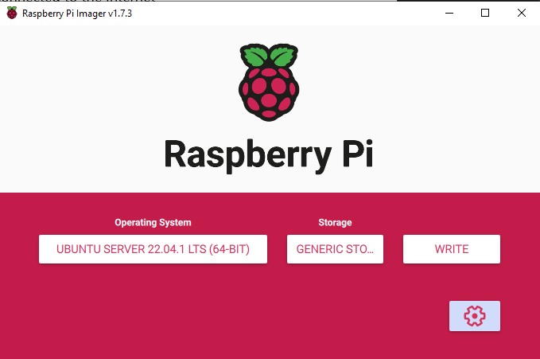

# Pi Setup

I like to start from a basic setup, as I am not going to work out the Pi start SD file set so I work from the [Uburtu core](https://ubuntu.com/download/raspberry-pi-core) as this is a min config.

 - [ ] wifi setup
 - [ ] user setup
 - [ ] Image update
 - [ ] pi firmware update
 - [ ] install packages needed

## [Install notes](https://ubuntu.com/tutorials/how-to-install-ubuntu-on-your-raspberry-pi)

[Cloud init docs](https://cloudinit.readthedocs.io/en/latest/)

